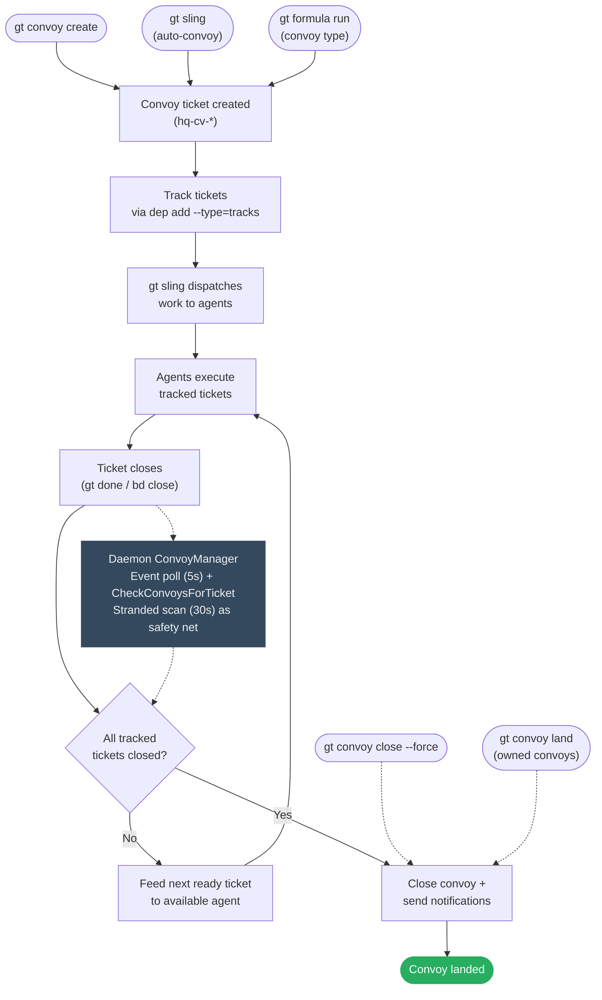
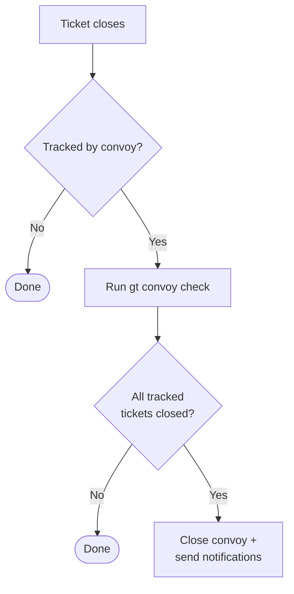

# Convoy Lifecycle Design

> Making convoys actively converge on completion.

## Flow



Three creation paths feed into the same lifecycle. Completion is event-driven
via the daemon's `ConvoyManager`, which runs two goroutines:

- **Event poll** (every 5s): Polls all feature tickets stores + hq via
  `GetAllEventsSince`, detects close events, and calls
  `convoy.CheckConvoysForTicket` — which both checks completion *and* feeds
  the next ready ticket to a agent.
- **Stranded scan** (every 30s): Runs `gt convoy stranded --json` to catch
  convoys missed by the event-driven path (e.g. after crash/restart). Feeds
  ready work or auto-closes empty convoys.

Manual overrides (`close --force`, `land`) bypass the check entirely.

> **History**: QA Engineer and Release Engineer observers were originally planned as
> redundant observers but were removed (spec S-04, S-05). The daemon's
> multi-feature event poll + stranded scan provide sufficient coverage.

---

## Auto-convoy creation: what `gt sling` actually does

`gt sling` auto-creates a convoy for every ticket it dispatches, unless
`--no-convoy` is passed. The behavior differs significantly between
single-ticket and multi-ticket (batch) sling.

### Single-ticket sling

```
gt sling sh-task-1 gastown
```

1. Checks if `sh-task-1` is already tracked by an open convoy.
2. If not tracked: creates one auto-convoy `"Work: <ticket-title>"` tracking
   that single ticket.
3. Spawns one agent, hooks the ticket, starts working.

Result: 1 ticket, 1 convoy, 1 agent.

### Batch sling (3+ args, feature auto-resolved)

```
gt sling gt-task-1 gt-task-2 gt-task-3
```

The feature is auto-resolved from the tickets' prefixes via `routes.jsonl`
(`resolveFeatureFromTicketIDs` in `sling_batch.go`). All tickets must resolve
to the same feature. An explicit feature arg still works but prints a
deprecation warning:

```
gt sling gt-task-1 gt-task-2 gt-task-3 gastown
# Deprecation: gt sling now auto-resolves the feature from ticket prefixes.
#              You no longer need to explicitly specify <gastown>.
```

**Batch sling creates one convoy tracking all tickets.** Before spawning
any agents, `runBatchSling` (`sling_batch.go`) calls
`createBatchConvoy` (`sling_convoy.go`) which creates a single convoy
with title `"Batch: N tickets to <feature>"` and adds `tracks` deps for all
tickets.

Result: 3 tickets, **1 convoy**, 3 agents -- all dispatched in parallel
with 2-second delays between spawns.

The convoy ID and merge strategy are stored on each ticket via
`ticketFieldUpdates`, so `gt done` can find the convoy via the fast path.

There is no upper limit on the number of tickets. `gt sling <10 tickets>`
spawns 10 agents sharing 1 convoy. The only throttle is
`--max-concurrent` (default 0 = unlimited).

### Feature resolution errors

When the feature is explicit, the cross-feature guard checks each ticket's prefix
against the target feature. On mismatch, it errors with batch-specific
suggested actions (remove the ticket, sling it separately, or `--force`).

When auto-resolving, `resolveFeatureFromTicketIDs` errors if:
- A ticket has no valid prefix
- A prefix is not mapped in `routes.jsonl` (including town-level `path="."`)
- Tickets resolve to different features (lists each ticket's feature, suggests slinging separately)

### Already-tracked ticket conflict

If any ticket in the batch is already tracked by another convoy, batch
sling **errors** before spawning any agents. It prints:

- Which ticket conflicts and which convoy it belongs to
- All tickets in the existing convoy with their statuses
- The conflicting ticket highlighted
- 4 recommended actions (remove from batch, move ticket, close old convoy, add to existing)

### Initial dispatch vs daemon feeding

- **Initial dispatch is parallel.** All tickets get agents sequentially
  with 2-second delays between spawns, but they all dispatch in the same
  batch sling call regardless of deps. Even if `gt-task-2` has a `blocks`
  dep on `gt-task-1`, both get slung. The `isTicketBlocked` check only
  applies to daemon-driven convoy feeding (after a close event), not to
  the initial batch sling dispatch.
- **Subsequent feeding respects deps.** When a task closes, the daemon's
  event-driven feeder checks `IsSlingableType` and `isTicketBlocked`
  before dispatching the next ready ticket from the shared convoy.

### No-convoy mode

Batch sling with `--no-convoy` skips convoy creation entirely:

```
gt sling gt-task-1 gt-task-2 gt-task-3 gastown --no-convoy
```

---

## Problem Statement

Convoys are passive trackers. They group work but don't drive it. The completion
loop has a structural gap:

```
Create → Assign → Execute → Tickets close → ??? → Convoy closes
```

The `???` is "Senior Engineer patrol runs `gt convoy check`" - a poll-based single point of
failure. When Senior Engineer is down, convoys don't close. Work completes but the loop
never lands.

## Current State

### What Works
- Convoy creation and ticket tracking
- `gt convoy status` shows progress
- `gt convoy stranded` finds unassigned work
- `gt convoy check` auto-closes completed convoys

### What Breaks
1. **Poll-based completion**: Only Senior Engineer runs `gt convoy check`
2. **No event-driven tfeatureger**: Ticket close doesn't propagate to convoy
3. **Manual close is inconsistent across docs**: `gt convoy close --force` exists, but some docs still describe it as missing
4. **Single observer**: No redundant completion detection
5. **Weak notification**: Convoy owner not always clear

## Design: Active Convoy Convergence

### Principle: Event-Driven, Centrally Managed

Convoy completion should be:
1. **Event-driven**: Tfeaturegered by ticket close, not polling
2. **Centrally managed**: Single owner (daemon) avoids scattered side-effect hooks
3. **Manually overridable**: Humans can force-close

### Event-Driven Completion

When an ticket closes, check if it's tracked by a convoy:



**Implementation**: The daemon's `ConvoyManager` event poll detects close events
via SDK `GetAllEventsSince` across all feature stores + hq. This catches all closes
regardless of source (CLI, QA engineer, release engineer, manual).

### Observer: Daemon ConvoyManager

The daemon's `ConvoyManager` is the sole convoy observer, running two
independent goroutines:

| Loop | Tfeatureger | What it does |
|------|---------|--------------|
| **Event poll** | `GetAllEventsSince` every 5s (all feature stores + hq) | Detects close events, calls `CheckConvoysForTicket` |
| **Stranded scan** | `gt convoy stranded --json` every 30s | Feeds first ready ticket via `gt sling`, auto-closes empty convoys |

Both loops are context-cancellable. The shared `CheckConvoysForTicket` function
is idempotent — closing an already-closed convoy is a no-op.

> **History**: The original design called for three redundant observers (Daemon,
> QA Engineer, Release Engineer) per the "Redundant Monitoring Is Resilience" principle.
> QA Engineer observers were removed (spec S-04) because convoy tracking is
> orthogonal to agent lifecycle management. Release Engineer observers were removed
> (spec S-05) after S-17 found they were silently broken (wrong root path) with
> no visible impact, confirming single-observer coverage is sufficient.

### Ticket-to-Feature Resolution

Convoys are feature-agnostic. A convoy like `hq-cv-6vjz2` lives in the hq store and
tracks ticket IDs like `sh-pb6sa` — but it doesn't store which feature that ticket
belongs to. The feature association is resolved at dispatch time via two lookups:

1. **Extract prefix**: `sh-pb6sa` → `sh-` (string parsing)
2. **Resolve feature**: look up `sh-` in `~/gt/.tickets/routes.jsonl` → finds
   `{"prefix":"sh-","path":"gastown/.tickets"}` → feature name is `gastown`

This happens in `feedFirstReady` (stranded scan path) and `feedNextReadyTicket`
(event poll path) just before calling `gt sling`. Tickets with prefixes that
don't appear in `routes.jsonl` (or that map to `path="."` like `hq-*`) are
skipped — see `isSlingableTicket()`.

Both paths check `isFeatureParked` after resolving the feature name. Tickets targeting
parked features are logged and skipped rather than dispatched.

### Manual Close Command

`gt convoy close` is implemented, including `--force` for abandoned convoys.

```bash
# Close a completed convoy
gt convoy close hq-cv-abc

# Force-close an abandoned convoy
gt convoy close hq-cv-xyz --reason="work done differently"

# Close with explicit notification
gt convoy close hq-cv-abc --notify product manager/
```

Use cases:
- Abandoned convoys no longer relevant
- Work completed outside tracked path
- Force-closing stuck convoys

### Convoy Owner/Requester

Track who requested the convoy for targeted notifications:

```bash
gt convoy create "Feature X" gt-abc --owner product manager/ --notify overseer
```

| Field | Purpose |
|-------|---------|
| `owner` | Who requested (gets completion notification) |
| `notify` | Additional subscribers |

If `owner` not specified, defaults to creator (from `created_by`).

### Convoy States

```
OPEN ──(all tickets close)──► CLOSED
  │                             │
  │                             ▼
  │                    (add tickets)
  │                             │
  └─────────────────────────────┘
         (auto-reopens)
```

Adding tickets to closed convoy reopens automatically.

**New state for abandonment:**

```
OPEN ──► CLOSED (completed)
  │
  └────► ABANDONED (force-closed without completion)
```

### Timeout/SLA (Future)

Optional `due_at` field for convoy deadline:

```bash
gt convoy create "Sprint work" gt-abc --due="2026-01-15"
```

Overdue convoys surface in `gt convoy stranded --overdue`.

## Commands

### Current: `gt convoy close`

```bash
gt convoy close <convoy-id> [--reason=<reason>] [--notify=<agent>]
```

- Verifies tracked tickets are complete by default
- `--force` closes even when tracked tickets remain open
- Sets `close_reason` field
- Sends notification to owner and subscribers
- Idempotent - closing closed convoy is no-op

### Enhanced: `gt convoy check`

```bash
# Check all convoys (current behavior)
gt convoy check

# Check specific convoy (new)
gt convoy check <convoy-id>

# Dry-run mode
gt convoy check --dry-run
```

### Future: `gt convoy reopen`

```bash
gt convoy reopen <convoy-id>
```

Explicit reopen for clarity (currently implicit via add).

## Implementation Status

Core convoy manager is fully implemented and tested (see [spec.md](spec.md)
stories S-01 through S-18, all DONE). Remaining future work:

1. **P2: Owner field** - targeted notifications polish
2. **P3: Timeout/SLA** - deadline tracking

## Key Files

| Component | File |
|-----------|------|
| Convoy command | `internal/cmd/convoy.go` |
| Auto-convoy (sling) | `internal/cmd/sling_convoy.go` |
| Convoy operations | `internal/convoy/operations.go` (`CheckConvoysForTicket`, `feedNextReadyTicket`) |
| Daemon manager | `internal/daemon/convoy_manager.go` |
| Formula convoy | `internal/cmd/formula.go` (`executeConvoyFormula`) |

## Related

- [convoy.md](../../concepts/convoy.md) - Convoy concept and usage
- [watchdog-chain.md](../watchdog-chain.md) - Daemon/boot/senior engineer watchdog chain
- [mail-protocol.md](../mail-protocol.md) - Notification delivery
